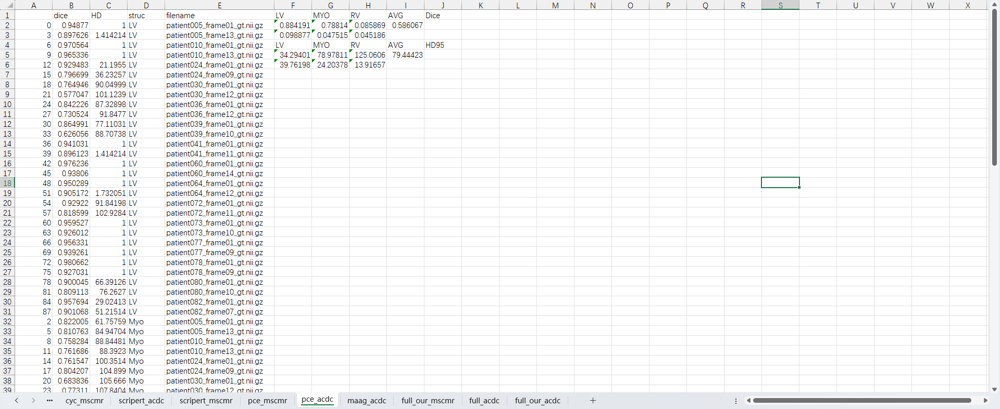

# ScribblePert: A Semantic Segmentation Method for Multi-Scale and Multi-Channel Scribble Annotation Using Label Perturbation
## The project is in the submission stage. Currently, the warehouse provides experimental test data. In the future, the experimental test code and training code will be gradually released.

## Currently public sections

### Experimental comparison data table

### Ablation experiment table

### Checkpoint

